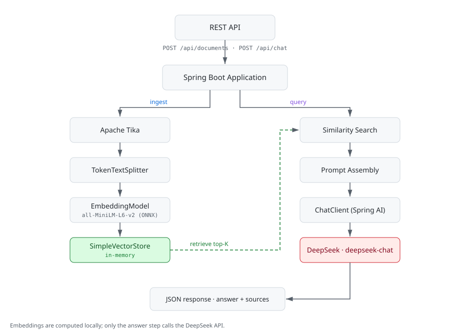
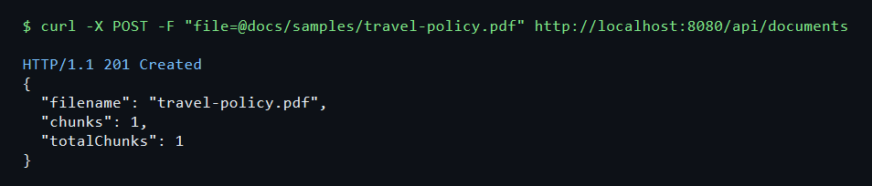
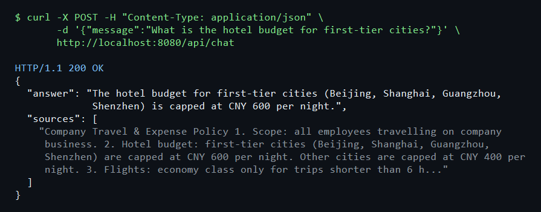

# Spring AI RAG Backend

A production-oriented RAG backend example built with **Spring Boot** and **Spring AI**.

This project demonstrates how to integrate document ingestion, local embeddings, vector similarity search, and LLM-based question answering into an existing Java backend application.



## Use Case

This project demonstrates a common enterprise scenario:

- Upload internal documents (PDF, DOCX, TXT, HTML, ...)
- Index and retrieve the relevant content
- Ask questions against the uploaded documents
- Generate answers grounded in the retrieved context, with the source snippets returned

The project is intentionally kept small so the core RAG workflow stays easy to follow.

## Tech Stack

| Component | Choice | Notes |
|---|---|---|
| Framework | Spring Boot 3.5 + Spring AI 1.1.8 | |
| LLM | DeepSeek (`deepseek-chat`) | Generates the answers; the API key stays in `application-local.yml` (not committed) or an environment variable |
| Embeddings | Local ONNX model `all-MiniLM-L6-v2` | DeepSeek offers no embedding API, so a local model is used — no extra API key |
| Vector store | `SimpleVectorStore` (in-memory) | Cleared on restart — see [Production Considerations](#production-considerations) |
| Document parsing | Apache Tika | PDF, DOCX, PPTX, TXT, HTML and more |
| Validation | Jakarta Bean Validation | Validated request DTOs plus a `@RestControllerAdvice` error handler |

## API

### `POST /api/documents` — upload and index a document



```bash
curl -X POST -F "file=@docs/samples/travel-policy.pdf" http://localhost:8080/api/documents
# HTTP/1.1 201 Created
# {"filename":"travel-policy.pdf","chunks":1,"totalChunks":1}
```

Supported formats: `pdf`, `doc`, `docx`, `ppt`, `pptx`, `txt`, `md`, `html`, `htm`. Anything else returns `415 Unsupported Media Type`; an empty file returns `400 Bad Request`.

### `POST /api/chat` — ask a question about the indexed documents



```bash
curl -X POST -H "Content-Type: application/json" \
     -d '{"message":"What is the hotel budget for first-tier cities?"}' \
     http://localhost:8080/api/chat
# HTTP/1.1 200 OK
# {"answer":"The hotel budget for first-tier cities ... is capped at CNY 600 per night.","sources":["..."]}
```

Errors use a consistent payload with a proper status code:

```json
{"status":400,"error":"Bad Request","message":"message must not be blank"}
```

A full record of these calls is kept in the [verification log](docs/verification.md).

## Quick Start

> **Prerequisites: JDK 17+ and Maven 3.6+.** Make sure your `JAVA_HOME` points to JDK 17 before running. The repository ships no Maven wrapper, so `mvn` must be available on your `PATH`.

### 1. Configure your DeepSeek API key

Get one at [platform.deepseek.com](https://platform.deepseek.com/api_keys). Put it into `application-local.yml` in the project root (git-ignored — it was committed once as a placeholder template and then untracked, so your real key never enters git):

```yaml
spring:
  ai:
    deepseek:
      api-key: sk-your-key
```

Or use an environment variable (higher precedence): `DEEPSEEK_API_KEY=sk-xxxx`.

### 2. Download the embedding model (first time only)

The embedding model (~90MB) is not committed to git. Download it with the platform-specific script:

- **Windows**: `powershell -File download-model.ps1`
- **Mac / Linux**: `bash download-model.sh`

Both fetch from Hugging Face. If `huggingface.co` is not reachable from your network (for example in mainland China), use the mirror instead:

- **Windows**: `powershell -File download-model.ps1 -Mirror`
- **Mac / Linux**: `bash download-model.sh mirror`

You can also skip the scripts and point `spring.ai.embedding.transformer.onnx.model-uri` / `tokenizer.uri` in `application.yml` at any reachable URL — see the comments there.

### 3. Run

```bash
mvn spring-boot:run
```

## Project Layout

```
src/main/java/com/example/ragdemo/
├── RagDemoApplication.java              # Bootstrap
├── config/VectorStoreConfig.java        # SimpleVectorStore bean
├── controller/
│   ├── DocumentController.java          # POST /api/documents
│   └── ChatController.java              # POST /api/chat
├── dto/                                 # ChatRequest, ChatResponse, UploadResponse, ApiError
├── exception/                           # InvalidRequestException, UnsupportedDocumentTypeException
├── service/
│   ├── DocumentService.java             # validate -> parse -> chunk -> embed -> store
│   └── RagService.java                  # retrieve -> assemble prompt -> answer
└── web/GlobalExceptionHandler.java      # exception -> HTTP status + JSON error payload
src/main/resources/
├── application.yml                      # Model config, multipart limits, optional local-config import
└── onnx/all-MiniLM-L6-v2/               # Embedding model (not committed; fetched by the download scripts)
src/test/java/com/example/ragdemo/
├── service/DocumentServiceTest.java     # upload validation and ingestion pipeline
├── service/RagServiceTest.java          # behaviour when no context is retrieved
└── web/ApiErrorHandlingTest.java        # 400 / 413 / 415 / 500 error mapping
docs/
├── images/                              # Architecture diagram and API screenshots
├── samples/travel-policy.pdf            # Sample document used in the examples
└── verification.md                      # End-to-end request/response records
application-local.yml                     # Local secrets — git-ignored
LICENSE
```

## Core Flow

**Ingestion** — `POST /api/documents`

1. `DocumentService` validates the upload (empty file, supported extension) and parses it with Apache Tika.
2. `TokenTextSplitter` splits the extracted text into token-sized chunks.
3. Each chunk is embedded locally (ONNX `all-MiniLM-L6-v2`) and stored in `SimpleVectorStore`.

**Query** — `POST /api/chat`

1. `RagService` embeds the question and runs a top-K similarity search (`TOP_K = 4`).
2. The retrieved chunks are assembled into the system prompt.
3. `ChatClient` calls DeepSeek and the answer is returned together with the source snippets.

## Production Considerations

This repository is intentionally simplified for demonstration.

For production use, the following areas should be extended:

- **Persistent vector store** (PGVector, Redis, ...) instead of the in-memory implementation
- **Authentication and authorization** on both endpoints
- **Stricter file validation**: content-type sniffing, per-user quotas, virus scanning
- **Asynchronous ingestion** so large documents do not block the request thread
- **Observability**: metrics, tracing and structured logging around retrieval and LLM calls
- **Retrieval evaluation**: recall/precision tracking and chunk-size tuning
- **Rate limiting and cost control** for LLM calls
- **Multi-user document isolation** through namespaces or metadata filters
- **Document registry** in a database with deduplication and re-indexing

## Author

GitHub: [@xtgq-glitch](https://github.com/xtgq-glitch)

## License

MIT — see [LICENSE](LICENSE).
